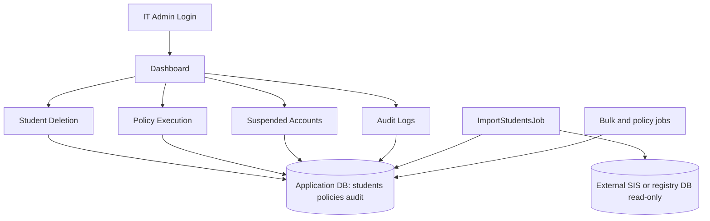

# Student lifecycle bulk deletion system

## Objectives

- Provide IT admins with a safe workflow to bulk **suspend** and **delete** student account records held in this application, at scale.
- **Ingest** authoritative student rows from an external database (SIS / registry) via a configurable, read-only connection and scheduled or on-demand import jobs—not from a directory sync vendor API.
- Keep all high-risk actions auditable with immutable, append-only event history.
- Automate repeatable lifecycle actions (policy evaluations and due-date deletions) while preserving admin control points.
- Reduce blast radius with scoped filters, explicit confirmation for deletes, rate limiting, admin-only destructive routes, and least-privilege DB credentials on the import connection.

## Use Cases

### UC-01 Admin Login
- **Actor:** IT Admin
- **Preconditions:** Admin account exists and is active.
- **Main Flow:** Admin submits credentials, receives API token, and accesses dashboard.
- **Postconditions:** Authenticated session established.
- **Alternate Flows:** Invalid credentials return validation/auth error; login rate limited per IP.

### UC-02 Filter and Suspend Accounts
- **Actor:** IT Admin
- **Preconditions:** Student table populated via import from external database.
- **Main Flow:** Admin filters by department, school year, graduation status, and graduation date range; selects students; confirms suspend action; system queues local suspend job.
- **Postconditions:** Target rows have `suspended = true` in application DB; per-account audit events recorded.
- **Alternate Flows:** Per-row failures logged in audit with error message; operation tracker shows partial failure counts.

### UC-03 Filter and Delete Accounts
- **Actor:** IT Admin
- **Preconditions:** Admin has selected target students and entered configured confirmation phrase.
- **Main Flow:** Admin confirms irreversible delete action; system queues local delete job which removes matching `students` rows.
- **Postconditions:** Deleted students removed from application DB; success/failure events are audited (audit rows retained).
- **Alternate Flows:** Incorrect confirmation phrase blocks request; errors audited per account.

### UC-04 Define Policy and Schedule
- **Actor:** IT Admin
- **Preconditions:** Policy module available; admin authenticated.
- **Main Flow:** Admin creates policy with rule scope, action, and execution time/cron metadata.
- **Postconditions:** Policy persisted and becomes eligible for scheduler evaluation.
- **Alternate Flows:** Validation errors (invalid action/date/rules) prevent persistence.

### UC-05 Auto-Execute Policy or Hold
- **Actor:** System Scheduler
- **Preconditions:** Active policies exist.
- **Main Flow:** Scheduler dispatches policy job, evaluates current time and matching students, applies local suspend/delete when conditions are met.
- **Postconditions:** Policy status updated (`executed` or `held`) and per-account audit events written.
- **Alternate Flows:** No matched users sets policy to hold with reason; per-account failures are captured.

### UC-06 Suspended List and Priority Flag
- **Actor:** IT Admin
- **Preconditions:** Suspended accounts exist in student table.
- **Main Flow:** Admin views suspended list and updates priority flags for review order.
- **Postconditions:** Priority metadata updated and available for operations/reporting.
- **Alternate Flows:** Unknown student returns not-found response.

### UC-07 Auto-Delete on Due Date
- **Actor:** System Scheduler
- **Preconditions:** Suspended students have `deletion_scheduled_at` set.
- **Main Flow:** Due-date job finds overdue suspended accounts and deletes rows locally via lifecycle service.
- **Postconditions:** Successful deletes remove student records and generate audit events.
- **Alternate Flows:** Failure keeps student row and writes failure audit entry for follow-up.

### UC-08 Audit Search, Export, and Review
- **Actor:** IT Admin / Security Reviewer
- **Preconditions:** Audit events exist.
- **Main Flow:** Reviewer filters audit feed by module/action/date range and exports CSV/PDF (admin role).
- **Postconditions:** Traceable record set is available for compliance and incident review.
- **Alternate Flows:** Empty result set still returns valid export with headers/metadata.

### UC-09 Import from External Database
- **Actor:** IT Admin (API), operator (Artisan), or Scheduler
- **Preconditions:** `STUDENT_IMPORT_ENABLED=true`; read-only external DB credentials on Laravel connection `source_students` (`SOURCE_DB_*`); `student_import.column_map` aligned with the source table or view; a valid strategy for `primary_email` (mapped column, optional CSV merge, and/or CEU formula generation—see [Student import from external registry](#student-import-from-external-registry)).
- **Main Flow:** `StudentImportService` reads the configured external table in ordered chunks, normalizes fields, resolves emails when needed, and **upserts** application `students` rows keyed by `external_account_id`, setting `last_imported_at` and storing the raw source row in `raw_json`.
- **Postconditions:** Summary audited (`processed`, `skipped_no_email`, `duration_ms`) for queued/API paths; CLI prints the same counters.
- **Alternate Flows:** Concurrent runs excluded via cache lock `student_import_lock`; rows without usable external id or valid email are skipped (`skipped_no_email`); misconfiguration throws before querying the source.

## Student import from external registry

This section is the operational guide for syncing student rows from an external SIS or registry database into the application database.

### What the importer does

- Connects using the Laravel DB connection named in `STUDENT_IMPORT_DB_CONNECTION` (default: `source_students`).
- Runs `SELECT *`-style reads from `STUDENT_IMPORT_TABLE` with optional static `WHERE` clauses defined **only** in `config/student_import.php` (`where` array)—never from HTTP input.
- Processes rows in chunks (`STUDENT_IMPORT_CHUNK_SIZE`, clamped between 50 and 2000).
- For each row, maps source columns to app attributes per `column_map`, normalizes `graduation_date` and optional `suspended`, optionally builds `full_name` from multiple CARES-style columns, resolves `primary_email`, then **upserts** on `external_account_id`.
- Sets `last_imported_at` on imported rows and saves the full source row as JSON in `raw_json` for traceability.

### Prerequisites checklist

1. **Enable the feature:** `STUDENT_IMPORT_ENABLED=true`.
2. **Wire the external database:** Set `SOURCE_DB_*` (and optional `SOURCE_DB_URL`) so the `source_students` connection in `config/database.php` reaches the registry with a **read-only** user where possible.
3. **Point at the correct table/view:** `STUDENT_IMPORT_TABLE` (e.g. CARES `lgrrs` or a read-only view).
4. **Column map:** At minimum, `external_account_id` must map to the stable student identifier column on the source. Other attributes map via `STUDENT_IMPORT_COL_*` env vars (see `backend/.env.example`).
5. **Chunk ordering:** Set `STUDENT_IMPORT_ORDER_BY_COLUMN` when the default (the external id column) is not suitable for stable `orderBy` + `chunk()`.
6. **Primary email:** You must satisfy one of the strategies in [Primary email strategies](#primary-email-strategies) or the import will refuse to run.

### Primary email strategies

The application requires a valid email for each imported row. Configure one or combine approaches:

| Approach | When to use | Configuration |
|----------|-------------|----------------|
| **Map from source** | Source table has an email column | Set `STUDENT_IMPORT_COL_EMAIL` to that column name (`column_map` then includes `primary_email`). |
| **CSV merge** | Source has no email column; you have an export (e.g. Google Workspace) with id → email | Set `STUDENT_IMPORT_EMAIL_CSV_PATH` to an absolute readable path, and align `STUDENT_IMPORT_EMAIL_CSV_ID_COLUMN` / `STUDENT_IMPORT_EMAIL_CSV_EMAIL_COLUMN` with the CSV headers. Invalid emails in the file are skipped with a warning log. |
| **CLI-only CSV** | Same as CSV but path varies per run | Run `php artisan students:import-from-source --email-csv=/path/to/file.csv` (overrides config path when provided). |
| **CEU formula** | No email column and CSV unavailable; IDs follow CEU “Email List Creation Formula” | Set `STUDENT_IMPORT_GENERATE_PRIMARY_EMAIL=true`, leave `STUDENT_IMPORT_COL_EMAIL` empty so `primary_email` is not sourced from the table, and tune `STUDENT_IMPORT_EMAIL_FORMULA_*` / domains. Implemented in `App\Services\CeuEmailListFormulaGenerator`. |

If `primary_email` is **not** mapped from the source, you must provide **either** a non-empty CSV map (config or `--email-csv`) **or** enable formula generation. The queued job and API import path load the CSV from config only; use Artisan when you need a one-off CSV path.

### Composite full name (CARES-style)

When the source stores first, middle, and last names in separate columns, set `STUDENT_IMPORT_COMPOSITE_FULL_NAME` to a comma-separated list of column names (e.g. `SZFNAME,SZMNAME,SZLNAME`). The importer joins non-empty parts with spaces into `full_name` and **ignores** any `full_name` entry in `column_map` for mapping purposes.

### Static filters and performance

- Add restrictive clauses only inside `config/student_import.php` → `'where' => [ ['COLUMN', '=', 'value'], ... ],` to limit scope (e.g. active term). Values must remain maintainer-controlled, not user-supplied.
- Tune `STUDENT_IMPORT_CHUNK_SIZE` for memory and DB load.
- `STUDENT_IMPORT_LOCK_TTL` (seconds) bounds how long the concurrent-import lock is held if a worker stops unexpectedly.

### How to run an import

| Trigger | Details |
|---------|---------|
| **Scheduler** | When `STUDENT_IMPORT_ENABLED` is true, `bootstrap/app.php` schedules `ImportStudentsJob` on `STUDENT_IMPORT_CRON` (default `0 2 * * *`). Requires the queue worker to process the default queue. |
| **API** | Authenticated admin calls `POST /students/import` (permission `student_import.run`, throttled). Returns `202` with `queued: true`. Passes user id and request correlation id into the job for audit. Uses config CSV path only—not `--email-csv`. |
| **Artisan** | `php artisan students:import-from-source` runs the import **inline** (not queued) when import is enabled. Optional `--email-csv=` merges emails from that file. |

### Concurrency and auditing

- **Lock:** `ImportStudentsJob` acquires `Cache::lock('student_import_lock', lock_ttl)`. If the lock is not acquired, the job exits without throwing (another import is in progress).
- **Audit (queued path only):** On success, `AuditLogger` records module `student_deletion`, action `student.import`, payload including `processed`, `skipped_no_email`, `duration_ms`, `source: database`, and optional `correlation_id`. Failures record the exception message. The Artisan command does not duplicate this audit—it prints counters to the console.

### Validation and common errors

- **`student_import.column_map must include external_account_id`:** Mapping missing or invalid after resolving empty string columns.
- **`Student import requires primary_email...`:** No column mapping, no CSV data, and formula generation off—enable one of the strategies above.
- **`Email CSV is not readable` / header errors:** Fix path, permissions, or header names to match `STUDENT_IMPORT_EMAIL_CSV_*`.
- **`Student upsert failed`:** Usually a DB constraint or type mismatch—inspect the wrapped SQL error and compare source types to the `students` table.

### Reference documentation

- Laravel task scheduling: [Task Scheduling](https://laravel.com/docs/scheduling)
- Queued jobs and workers: [Queues](https://laravel.com/docs/queues)

## Operational Prompts

### User-Facing Confirmation Prompts
- **Suspend Prompt:** "Suspend selected accounts now?"
- **Delete Prompt (irreversible):** "Delete selected accounts permanently? This action cannot be undone."
- **Delete Phrase Prompt:** "Type the configured confirmation phrase to continue."
- **Policy Hold Notice:** "Policy execution is on hold: no matching accounts or scheduled time not reached."
- **Bulk Result Banner:** "Operation completed with partial failures. Review audit log details."

### Validation and Error Prompts
- "At least one external account id is required (`account_ids` or legacy `google_ids`)."
- "Confirmation phrase does not match organization policy."
- "Student import is disabled." / import mapping misconfiguration messages.
- "Export request exceeds allowed limits. Narrow your filters and try again."

### System-Generated Notification Templates
- **Policy Executed:** "Policy `{policy_name}` executed for `{count}` account(s)."
- **Policy Held:** "Policy `{policy_name}` held: `{reason}`."
- **Due-Date Sweep Failure:** "Auto-delete failed for `{external_account_id}`: `{error}`."

## Algorithms

### Audit append pipeline

```text
function recordAudit(module, action, targetAccountId, payload, success, error, actor, request):
  correlationId = request.header("X-Correlation-Id") or generateUuid()
  insert into audit_events (
    actor_user_id,
    module,
    action,
    target_account_id,
    payload_json,
    success,
    error_message,
    correlation_id,
    ip_address,
    user_agent,
    created_at
  )
  return correlationId
```

### External import (chunked upsert)

```text
ImportStudentsJob / StudentImportService (CLI runs service directly):
  acquire cache lock "student_import_lock" (job only; CLI does not use lock)
  map = resolved column_map (drop full_name mapping if composite_full_name_columns set)
  optional emailMap = CSV from config path, --email-csv, or null
  if primary_email not in map and no emailMap and generate_primary_email false:
    fail fast (InvalidArgumentException)
  query = source connection.table(source_table) + static where[] from config
  orderBy = STUDENT_IMPORT_ORDER_BY_COLUMN or external_account_id source column
  for each chunk:
    map columns; composite full_name; merge CSV email or CEU formula when needed
    skip row if no external_account_id, no valid email, or invalid email format
    upsert students on external_account_id; set last_imported_at, raw_json
  job: audit student.import with processed, skipped_no_email, duration_ms
```

### Policy evaluation and scheduling

```text
on schedule:
  dispatch EvaluatePoliciesJob

EvaluatePoliciesJob:
  for each active policy:
    set last_evaluated_at = now
    if execution_at is in future:
      mark held("Execution time not reached")
      continue

    students = query students by rule_json filters (department, school_year)
    if students is empty:
      mark held("No accounts matched policy scope")
      continue

    for each student:
      perform local suspend or delete via StudentAccountLifecycleService
      write success/failure audit event

    mark policy executed or held if any failure
```

### Suspended due-date sweep

```text
on schedule:
  dispatch ProcessSuspendedDueDatesJob

ProcessSuspendedDueDatesJob:
  dueStudents = students where suspended=true and deletion_scheduled_at <= now
  for each student in dueStudents:
    try local deleteByExternalAccountId
      write success audit (payload includes prior student_id)
    catch error:
      write failure audit
      keep student for retry/triage
```

### Batch suspend/delete (queued)

```text
POST /students/suspend|delete:
  validate account_ids (max N), delete requires confirmation phrase
  dispatch ProcessBulkAccountActionJob

ProcessBulkAccountActionJob:
  for each external_account_id:
    suspend: set suspended=true
    delete: delete student row
    append audit per row
    update operation tracker in cache + bulk_action_operations
```

### Export query planning (CSV/PDF)

```text
function exportAudit(format, filters):
  baseQuery = audit_events filtered by module/action/date range
  if format == csv:
    stream in chunks (e.g., 500 rows) to avoid memory spikes
  if format == pdf:
    limit rows for render safety (e.g., <= 500)
    render blade template with selected rows
  return download response
```

## Architecture (Mermaid)



## Security and compliance notes

- Use a **read-only** database user for `source_students`; never concatenate request input into source SQL—only vetted config for table name and static `where` clauses.
- Store `DELETE_CONFIRMATION_PHRASE` and DB credentials in environment / secret store only.
- Enforce **admin role** middleware on import, bulk suspend/delete, policy mutations, and audit exports; throttle login and sensitive routes; optional full `STUDENT_IMPORT_ENABLED` gate.
- HTTP security headers (`X-Content-Type-Options`, `X-Frame-Options`, `Referrer-Policy`, production **HSTS**) on API responses.
- Tighten **CORS** in non-local environments via `CORS_ALLOWED_ORIGINS`.
- Keep delete operations behind explicit confirmation phrase and audit every outcome.
- Use correlation IDs end-to-end across API, queue jobs, and audit records for forensic traceability.
