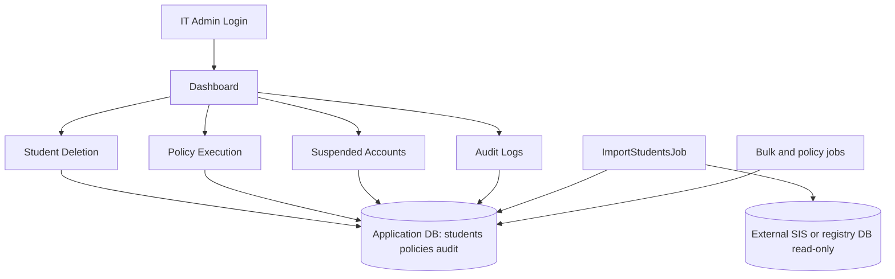

# Student lifecycle bulk deletion system

## Objectives

- Provide IT admins with a safe workflow to bulk **suspend** and **delete** student account records held in this application, at scale.
- **Ingest** authoritative student rows from an external database (SIS / registry) via a configurable, read-only connection and scheduled or on-demand import jobs—not from a directory sync vendor API.
- Keep all high-risk actions auditable with immutable, append-only event history.
- Automate repeatable lifecycle actions (policy evaluations and due-date deletions) while preserving admin control points.
- Reduce blast radius with scoped filters, explicit confirmation for deletes, rate limiting, admin-only destructive routes, and least-privilege DB credentials on the import connection.

## Use Cases

### UC-01 Admin Login
- **Actor:** IT Admin
- **Preconditions:** Admin account exists and is active.
- **Main Flow:** Admin submits credentials, receives API token, and accesses dashboard.
- **Postconditions:** Authenticated session established.
- **Alternate Flows:** Invalid credentials return validation/auth error; login rate limited per IP.

### UC-02 Filter and Suspend Accounts
- **Actor:** IT Admin
- **Preconditions:** Student table populated via import from external database.
- **Main Flow:** Admin filters by department, school year, graduation status, and graduation date range; selects students; confirms suspend action; system queues local suspend job.
- **Postconditions:** Target rows have `suspended = true` in application DB; per-account audit events recorded.
- **Alternate Flows:** Per-row failures logged in audit with error message; operation tracker shows partial failure counts.

### UC-03 Filter and Delete Accounts
- **Actor:** IT Admin
- **Preconditions:** Admin has selected target students and entered configured confirmation phrase.
- **Main Flow:** Admin confirms irreversible delete action; system queues local delete job which removes matching `students` rows.
- **Postconditions:** Deleted students removed from application DB; success/failure events are audited (audit rows retained).
- **Alternate Flows:** Incorrect confirmation phrase blocks request; errors audited per account.

### UC-04 Define Policy and Schedule
- **Actor:** IT Admin
- **Preconditions:** Policy module available; admin authenticated.
- **Main Flow:** Admin creates policy with rule scope, action, and execution time/cron metadata.
- **Postconditions:** Policy persisted and becomes eligible for scheduler evaluation.
- **Alternate Flows:** Validation errors (invalid action/date/rules) prevent persistence.

### UC-05 Auto-Execute Policy or Hold
- **Actor:** System Scheduler
- **Preconditions:** Active policies exist.
- **Main Flow:** Scheduler dispatches policy job, evaluates current time and matching students, applies local suspend/delete when conditions are met.
- **Postconditions:** Policy status updated (`executed` or `held`) and per-account audit events written.
- **Alternate Flows:** No matched users sets policy to hold with reason; per-account failures are captured.

### UC-06 Suspended List and Priority Flag
- **Actor:** IT Admin
- **Preconditions:** Suspended accounts exist in student table.
- **Main Flow:** Admin views suspended list and updates priority flags for review order.
- **Postconditions:** Priority metadata updated and available for operations/reporting.
- **Alternate Flows:** Unknown student returns not-found response.

### UC-07 Auto-Delete on Due Date
- **Actor:** System Scheduler
- **Preconditions:** Suspended students have `deletion_scheduled_at` set.
- **Main Flow:** Due-date job finds overdue suspended accounts and deletes rows locally via lifecycle service.
- **Postconditions:** Successful deletes remove student records and generate audit events.
- **Alternate Flows:** Failure keeps student row and writes failure audit entry for follow-up.

### UC-08 Audit Search, Export, and Review
- **Actor:** IT Admin / Security Reviewer
- **Preconditions:** Audit events exist.
- **Main Flow:** Reviewer filters audit feed by module/action/date range and exports CSV/PDF (admin role).
- **Postconditions:** Traceable record set is available for compliance and incident review.
- **Alternate Flows:** Empty result set still returns valid export with headers/metadata.

### UC-09 Import from External Database
- **Actor:** IT Admin or Scheduler
- **Preconditions:** `STUDENT_IMPORT_ENABLED=true`; read-only `source_students` connection; column map matches source table/view.
- **Main Flow:** Import job reads external table in chunks, upserts into `students` by `external_account_id`, sets `last_imported_at`.
- **Postconditions:** Row counts and duration audited under `student.import`.
- **Alternate Flows:** Second concurrent import skipped (cache lock); connection or mapping errors audited as failure.

## Operational Prompts

### User-Facing Confirmation Prompts
- **Suspend Prompt:** "Suspend selected accounts now?"
- **Delete Prompt (irreversible):** "Delete selected accounts permanently? This action cannot be undone."
- **Delete Phrase Prompt:** "Type the configured confirmation phrase to continue."
- **Policy Hold Notice:** "Policy execution is on hold: no matching accounts or scheduled time not reached."
- **Bulk Result Banner:** "Operation completed with partial failures. Review audit log details."

### Validation and Error Prompts
- "At least one external account id is required (`account_ids` or legacy `google_ids`)."
- "Confirmation phrase does not match organization policy."
- "Student import is disabled." / import mapping misconfiguration messages.
- "Export request exceeds allowed limits. Narrow your filters and try again."

### System-Generated Notification Templates
- **Policy Executed:** "Policy `{policy_name}` executed for `{count}` account(s)."
- **Policy Held:** "Policy `{policy_name}` held: `{reason}`."
- **Due-Date Sweep Failure:** "Auto-delete failed for `{external_account_id}`: `{error}`."

## Algorithms

### Audit append pipeline

```text
function recordAudit(module, action, targetAccountId, payload, success, error, actor, request):
  correlationId = request.header("X-Correlation-Id") or generateUuid()
  insert into audit_events (
    actor_user_id,
    module,
    action,
    target_account_id,
    payload_json,
    success,
    error_message,
    correlation_id,
    ip_address,
    user_agent,
    created_at
  )
  return correlationId
```

### External import (chunked upsert)

```text
ImportStudentsJob (with cache lock "student_import_lock"):
  map = config student_import.column_map (app_field => source_column)
  query = SELECT * FROM source_table [static where clauses from config only]
  for each chunk of rows:
    normalize dates/booleans
    upsert into students on external_account_id
  audit student.import with processed count and duration_ms
```

### Policy evaluation and scheduling

```text
on schedule:
  dispatch EvaluatePoliciesJob

EvaluatePoliciesJob:
  for each active policy:
    set last_evaluated_at = now
    if execution_at is in future:
      mark held("Execution time not reached")
      continue

    students = query students by rule_json filters (department, school_year)
    if students is empty:
      mark held("No accounts matched policy scope")
      continue

    for each student:
      perform local suspend or delete via StudentAccountLifecycleService
      write success/failure audit event

    mark policy executed or held if any failure
```

### Suspended due-date sweep

```text
on schedule:
  dispatch ProcessSuspendedDueDatesJob

ProcessSuspendedDueDatesJob:
  dueStudents = students where suspended=true and deletion_scheduled_at <= now
  for each student in dueStudents:
    try local deleteByExternalAccountId
      write success audit (payload includes prior student_id)
    catch error:
      write failure audit
      keep student for retry/triage
```

### Batch suspend/delete (queued)

```text
POST /students/suspend|delete:
  validate account_ids (max N), delete requires confirmation phrase
  dispatch ProcessBulkAccountActionJob

ProcessBulkAccountActionJob:
  for each external_account_id:
    suspend: set suspended=true
    delete: delete student row
    append audit per row
    update operation tracker in cache + bulk_action_operations
```

### Export query planning (CSV/PDF)

```text
function exportAudit(format, filters):
  baseQuery = audit_events filtered by module/action/date range
  if format == csv:
    stream in chunks (e.g., 500 rows) to avoid memory spikes
  if format == pdf:
    limit rows for render safety (e.g., <= 500)
    render blade template with selected rows
  return download response
```

## Architecture (Mermaid)



## Security and compliance notes

- Use a **read-only** database user for `source_students`; never concatenate request input into source SQL—only vetted config for table name and static `where` clauses.
- Store `DELETE_CONFIRMATION_PHRASE` and DB credentials in environment / secret store only.
- Enforce **admin role** middleware on import, bulk suspend/delete, policy mutations, and audit exports; throttle login and sensitive routes; optional full `STUDENT_IMPORT_ENABLED` gate.
- HTTP security headers (`X-Content-Type-Options`, `X-Frame-Options`, `Referrer-Policy`, production **HSTS**) on API responses.
- Tighten **CORS** in non-local environments via `CORS_ALLOWED_ORIGINS`.
- Keep delete operations behind explicit confirmation phrase and audit every outcome.
- Use correlation IDs end-to-end across API, queue jobs, and audit records for forensic traceability.
